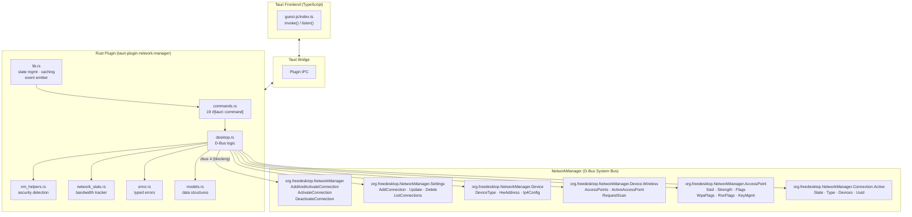

# Tauri Network Manager Plugin

[](https://crates.io/crates/tauri-plugin-network-manager)
[](LICENSE)
[](Cargo.toml)
[](https://tauri.app)

> Linux-first Tauri plugin to manage network state, Wi-Fi, and VPN through **NetworkManager** over **D-Bus**.

---

## Table of Contents

- [Features](#features)
- [Architecture](#architecture)
- [Requirements](#requirements)
- [Installation](#installation)
- [Permissions](#permissions)
- [Quick Start](#quick-start)
- [API Reference](#api-reference)
- [TypeScript Usage](#typescript-usage)
- [Event System](#event-system)
- [Error Handling](#error-handling)
- [Caching](#caching)
- [Types](#types)
- [Package Exports](#package-exports)
- [Testing & Build](#testing--build)
- [Contributing](#contributing)

---

## Features

### Wi-Fi
- Scan & list nearby access points with signal strength and security detection
- Connect to open / WEP / WPA-PSK / WPA2-PSK / WPA3-PSK / WPA-EAP networks
- Disconnect from current Wi-Fi
- List and delete saved Wi-Fi connections
- Request explicit scans

### VPN
- List, create, update, delete VPN profiles (OpenVPN, WireGuard, L2TP, PPTP, SSTP, IKEv2, FortiSSL, OpenConnect, Generic)
- Connect / disconnect VPN by UUID
- Read current VPN status, gateway, IP configuration

### Network State
- Read current active network (Ethernet / Wi-Fi) — SSID, IP, MAC, signal, security
- Enable / disable wireless and global networking
- Check wireless hardware availability

### Monitoring
- Bandwidth stats (download/upload speed, total bytes, uptime)
- Real-time events via Tauri's event system:
  - `network-changed` — network state transition
  - `vpn-changed`, `vpn-connected`, `vpn-disconnected`, `vpn-failed`

---

## Architecture



### Key modules

| Module | Responsibility |
|---|---|
| `lib.rs` | Tauri plugin entry point, state management (`Arc<RwLock>`), network change event emitter with 250 ms debounce |
| `desktop.rs` | All D-Bus calls via zbus 4: network state, Wi-Fi scan/connect, VPN CRUD, signal listening |
| `commands.rs` | 19 `#[tauri::command]` functions bridging IPC to `desktop.rs` |
| `nm_helpers.rs` | Security type detection (`KeyMgmt` / `WpaFlags` / `RsnFlags`), SSID byte→string conversion, connectivity check |
| `network_stats.rs` | Bandwidth tracker reading `/sys/class/net/<iface>/statistics` |
| `error.rs` | Typed error enum with `thiserror`, D-Bus error mapping |
| `models.rs` | All data structures: `NetworkInfo`, `WiFiConnectionConfig`, `VpnProfile`, etc. |

---

## Requirements

- **Linux** with **NetworkManager** running on D-Bus system bus
- **Tauri 2** project
- **Rust 1.77.2+**
- System D-Bus libraries (`libdbus-1-dev` or equivalent)

---

## Installation

### Cargo

```toml
[dependencies]
tauri-plugin-network-manager = { git = "https://github.com/Vasak-OS/tauri-plugin-network-manager" }
```

### NPM (guest bindings)

```bash
bun add @vasakgroup/plugin-network-manager
# or
npm install @vasakgroup/plugin-network-manager
# or
pnpm add @vasakgroup/plugin-network-manager
```

### Register the plugin

```rust
// src-tauri/src/lib.rs
fn main() {
    tauri::Builder::default()
        .plugin(tauri_plugin_network_manager::init())
        .run(tauri::generate_context!())
        .expect("error while running tauri application");
}
```

---

## Permissions

By default the plugin allows **read + Wi-Fi connect/disconnect** operations.
**VPN mutations** are opt-in.

### Default permission set

```jsonc
// src-tauri/capabilities/default.json
{
  "identifier": "default",
  "windows": ["main"],
  "permissions": [
    "network-manager:default"
  ]
}
```

The default set includes:
- `get-network-state`, `list-wifi-networks`, `rescan-wifi`
- `connect-to-wifi`, `disconnect-from-wifi`
- `get-saved-wifi-networks`, `delete-wifi-connection`
- `toggle-network-state`, `get-wireless-enabled`, `set-wireless-enabled`
- `is-wireless-available`, `list-vpn-profiles`, `get-vpn-status`

### VPN management permission

```jsonc
{
  "permissions": [
    "network-manager:vpn_management",
    // or individually:
    "network-manager:allow-connect-vpn",
    "network-manager:allow-disconnect-vpn",
    "network-manager:allow-create-vpn-profile",
    "network-manager:allow-update-vpn-profile",
    "network-manager:allow-delete-vpn-profile"
  ]
}
```

---

## Quick Start

### Wi-Fi — scan and connect

```typescript
import {
  listWifiNetworks,
  connectToWifi,
  disconnectFromWifi,
  WiFiSecurityType,
} from '@vasakgroup/plugin-network-manager';

// 1. Scan available networks
const networks = await listWifiNetworks();
console.log(networks.map(n => `${n.ssid} (${n.signal_strength}%)`));

// 2. Connect to a WPA2-PSK network
await connectToWifi({
  ssid: 'MyNetwork',
  password: 'supersecret',
  securityType: WiFiSecurityType.WPA2_PSK,
});

// 3. Disconnect
await disconnectFromWifi();
```

### VPN — create, connect, and listen

```typescript
import {
  createVpnProfile,
  connectVpn,
  getVpnStatus,
  disconnectVpn,
  deleteVpnProfile,
} from '@vasakgroup/plugin-network-manager';
import { listen } from '@tauri-apps/api/event';
import type { VpnEventPayload } from '@vasakgroup/plugin-network-manager';

// Listen for VPN state changes
const unlisten = await listen<VpnEventPayload>('vpn-changed', (e) => {
  console.log('VPN state:', e.payload.status.state);
});

// Create and connect
const profile = await createVpnProfile({
  id: 'Office VPN',
  vpn_type: 'wire-guard',
  settings: { endpoint: 'vpn.example.com:51820' },
  secrets: { private_key: '***' },
});

await connectVpn(profile.uuid);
console.log(await getVpnStatus());

// Cleanup
await disconnectVpn(profile.uuid);
await deleteVpnProfile(profile.uuid);
unlisten();
```

### Network monitoring

```typescript
import { getNetworkStats } from '@vasakgroup/plugin-network-manager';

const stats = await getNetworkStats();
console.log({
  download: `${stats.download_speed} B/s`,
  upload: `${stats.upload_speed} B/s`,
  totalDown: `${(stats.total_downloaded / 1e6).toFixed(1)} MB`,
  uptime: `${stats.connection_duration}s`,
});
```

---

## API Reference

### `getCurrentNetworkState(): Promise<NetworkInfo>`

Returns the currently active network connection info, or a default if disconnected.

### `listWifiNetworks(options?: ListWifiNetworksOptions): Promise<NetworkInfo[]>`

Scans and returns all visible access points, deduplicated by SSID, sorted by signal strength.

| Option | Type | Default | Description |
|---|---|---|---|
| `forceRefresh` | `boolean` | `false` | Bypass in-memory cache |
| `ttlMs` | `number` | `3000` | Cache TTL in milliseconds (250–30000) |

### `rescanWifi(): Promise<NetworkInfo[]>`

Triggers a `RequestScan` D-Bus call on all wireless devices and returns fresh results.

### `connectToWifi(config: ConnectToWifiInput | WiFiConnectionConfig): Promise<void>`

Accepts both camelCase (frontend-friendly) and snake_case (Rust wire) formats.

| Field | Type | Required | Description |
|---|---|---|---|
| `ssid` | `string` | yes | Network SSID |
| `password` | `string` | no | PSK / password |
| `securityType` / `security_type` | `WiFiSecurityType` | yes | See [WiFiSecurityType](#wifisecuritytype) |
| `username` | `string` | no | WPA-EAP identity |

**Supported security types:**

| Value | D-Bus `key-mgmt` | Notes |
|---|---|---|
| `None` | — | Open network |
| `Wep` | `none` | Static WEP with `wep-key0` |
| `WpaPsk` | `wpa-psk` | WPA1-PSK |
| `Wpa2Psk` | `wpa-psk` + `proto=["rsn"]` | WPA2-PSK |
| `Wpa3Psk` | `sae` | WPA3-SAE |
| `WpaEap` | `wpa-eap` | Enterprise WPA-EAP |

### `disconnectFromWifi(): Promise<void>`

Deactivates the active Wi-Fi connection.

### `getSavedWifiNetworks(): Promise<NetworkInfo[]>`

Returns saved Wi-Fi profiles (known networks) from NM settings, with SSID and detected security type.

### `deleteWifiConnection(ssid: string): Promise<void>`

Deletes the first saved connection matching the given SSID.

### `toggleNetwork(enabled: boolean): Promise<boolean>`

Enables or disables all networking. Returns the new state.

### `getWirelessEnabled(): Promise<boolean>`

Returns whether Wi-Fi radio is enabled.

### `setWirelessEnabled(enabled: boolean): Promise<void>`

Enables or disables Wi-Fi radio.

### `isWirelessAvailable(): Promise<boolean>`

Returns `true` if at least one Wi-Fi adapter is present.

### `listVpnProfiles(): Promise<VpnProfile[]>`

Returns all VPN profiles sorted by ID.

### `getVpnStatus(): Promise<VpnStatus>`

Returns the current active VPN state, profile info, gateway, and IP.

### `connectVpn(uuid: string): Promise<void>`

Activates a VPN by UUID. Throws `VpnAlreadyConnected` if already connected to the same profile.

### `disconnectVpn(uuid?: string): Promise<void>`

Deactivates a VPN. If `uuid` is omitted, deactivates the currently active VPN (`VpnNotActive` if none).

### `createVpnProfile(config: VpnCreateInput): Promise<VpnProfile>`

Creates a new VPN profile in NM settings. Requires `vpn_management` permission.

| Field | Type | Required | Description |
|---|---|---|---|
| `id` | `string` | yes | Profile display name |
| `vpn_type` | `VpnType` | yes | See [VpnType](#vpntype) |
| `autoconnect` | `boolean` | no | Auto-connect on boot |
| `username` | `string` | no | VPN username |
| `gateway` | `string` | no | Remote gateway address |
| `ca_cert_path` | `string` | no | CA certificate path |
| `user_cert_path` | `string` | no | User certificate path |
| `private_key_path` | `string` | no | Private key path |
| `private_key_password` | `string` | no | Private key passphrase |
| `settings` | `Record<string, string>` | no | Custom VPN settings |
| `secrets` | `Record<string, string>` | no | Custom VPN secrets (e.g. `psk`, `private_key`) |

### `updateVpnProfile(config: VpnUpdateInput): Promise<VpnProfile>`

Updates an existing VPN profile. All fields except `uuid` are optional.

| Field | Type | Description |
|---|---|---|
| `uuid` | `string` | Profile UUID to update (required) |
| `id` | `string` | New display name |
| `autoconnect` | `boolean` | New auto-connect preference |
| `username` | `string` | New username |
| `gateway` | `string` | New remote address |
| `ca_cert_path` | `string` | New CA cert path |
| `user_cert_path` | `string` | New user cert path |
| `private_key_path` | `string` | New private key path |
| `private_key_password` | `string` | New passphrase |
| `settings` | `Record<string, string>` | Merged into existing settings |
| `secrets` | `Record<string, string>` | Merged into existing secrets |

### `deleteVpnProfile(uuid: string): Promise<void>`

Deletes a VPN profile by UUID.

### `getNetworkStats(): Promise<NetworkStats>`

Returns bandwidth statistics for the active interface.

```typescript
interface NetworkStats {
  download_speed: number;    // bytes/sec
  upload_speed: number;      // bytes/sec
  total_downloaded: number;  // bytes
  total_uploaded: number;    // bytes
  connection_duration: number; // seconds
  interface: string;         // e.g. "wlan0"
}
```

### `getNetworkInterfaces(): Promise<string[]>`

Returns all non-loopback network interface names.

---

## Event System

The plugin emits Tauri events when network state changes, with a 250 ms debounce window to coalesce rapid transitions.

### Events

| Event | Payload | When |
|---|---|---|
| `network-changed` | `NetworkInfo` | Any network state transition |
| `vpn-changed` | `VpnEventPayload` | VPN state transition |
| `vpn-connected` | `VpnEventPayload` | Transition to `Connected` |
| `vpn-disconnected` | `VpnEventPayload` | Transition to `Disconnected` |
| `vpn-failed` | `VpnEventPayload` | Transition to `Failed` |

### Example

```typescript
import { listen } from '@tauri-apps/api/event';
import type { NetworkInfo, VpnEventPayload } from '@vasakgroup/plugin-network-manager';

// Network changes
const unlistenNet = await listen<NetworkInfo>('network-changed', (event) => {
  const n = event.payload;
  const status = n.is_connected ? `connected to ${n.ssid}` : 'disconnected';
  console.log(`[${n.connection_type}] ${status} (${n.ip_address})`);
});

// VPN failures
const unlistenFail = await listen<VpnEventPayload>('vpn-failed', (event) => {
  console.error(`VPN failed: ${event.payload.reason}`);
});

// Cleanup when leaving component
// unlistenNet();
// unlistenFail();
```

---

## Error Handling

All commands throw a typed `NetworkManagerError` with a `code` property:

```typescript
import { connectToWifi, NetworkManagerErrorCode } from '@vasakgroup/plugin-network-manager';

try {
  await connectToWifi({ ssid: '...', password: '...', securityType: 'wpa2-psk' });
} catch (e) {
  if (e.code === NetworkManagerErrorCode.CONNECTION_FAILED) {
    showToast('Connection failed. Check password.');
  } else if (e.code === NetworkManagerErrorCode.UNSUPPORTED_SECURITY) {
    showToast('This security type is not supported.');
  } else {
    showToast(`Unexpected error: ${e.message}`);
  }
}
```

### Error codes

| Code | Meaning |
|---|---|
| `NOT_INITIALIZED` | Plugin not initialized |
| `NO_CONNECTION` | No active network |
| `PERMISSION_DENIED` | Capability not granted |
| `UNSUPPORTED_SECURITY` | Security type not implemented |
| `CONNECTION_FAILED` | D-Bus connection call failed |
| `NETWORK_NOT_FOUND` | SSID not in saved networks |
| `OPERATION_FAILED` | Generic failure |
| `VPN_PROFILE_NOT_FOUND` | UUID not in settings |
| `VPN_ALREADY_CONNECTED` | Already connected to that profile |
| `VPN_AUTH_FAILED` | Secret/authentication error |
| `VPN_INVALID_CONFIG` | Bad profile parameters |
| `VPN_ACTIVATION_FAILED` | ActivateConnection D-Bus error |
| `VPN_PLUGIN_UNAVAILABLE` | NM plugin not found |
| `VPN_NOT_ACTIVE` | No active VPN to disconnect |
| `UNKNOWN` | Fallback |

---

## Caching

Wi-Fi scan results are cached in-memory for **3 seconds** by default to avoid redundant D-Bus calls.

```typescript
// Bypass cache
const fresh = await listWifiNetworks({ forceRefresh: true });

// Custom TTL (500 ms)
const fast = await listWifiNetworks({ ttlMs: 500 });

// rescanWifi always invalidates cache and returns fresh data
```

---

## Types

### `WiFiSecurityType`

```typescript
type WiFiSecurityType =
  | 'none'
  | 'wep'
  | 'wpa-psk'
  | 'wpa-eap'
  | 'wpa2-psk'
  | 'wpa3-psk';
```

### `VpnType`

```typescript
type VpnType =
  | 'open-vpn'
  | 'wire-guard'
  | 'l2tp'
  | 'pptp'
  | 'sstp'
  | 'ikev2'
  | 'fortisslvpn'
  | 'open-connect'
  | 'generic';
```

### `VpnConnectionState`

```typescript
type VpnConnectionState =
  | 'disconnected'
  | 'connecting'
  | 'connected'
  | 'disconnecting'
  | 'failed'
  | 'unknown';
```

### `NetworkInfo`

```typescript
interface NetworkInfo {
  name: string;
  ssid: string;
  connection_type: string;      // "wifi" | "Ethernet" | "Unknown"
  icon: string;                  // icon name for the UI
  ip_address: string;            // "0.0.0.0" when disconnected
  mac_address: string;
  signal_strength: number;       // 0–100
  security_type: WiFiSecurityType;
  is_connected: boolean;
}
```

### `VpnProfile`

```typescript
interface VpnProfile {
  id: string;
  uuid: string;
  vpn_type: VpnType;
  interface_name: string | null;
  autoconnect: boolean;
  editable: boolean;
  last_error: string | null;
}
```

### `VpnStatus`

```typescript
interface VpnStatus {
  state: VpnConnectionState;
  active_profile_id: string | null;
  active_profile_uuid: string | null;
  active_profile_name: string | null;
  ip_address: string | null;
  gateway: string | null;
  since_unix_ms: number | null;
}
```

### `VpnEventPayload`

```typescript
interface VpnEventPayload {
  status: VpnStatus;
  profile: VpnProfile | null;
  reason: string | null;  // populated on 'vpn-failed'
}
```

---

## Package Exports

The NPM package provides ESM, CJS, and TypeScript declarations:

```json
{
  "main": "./dist-js/index.cjs",
  "module": "./dist-js/index.js",
  "types": "./dist-js/index.d.ts",
  "exports": {
    "types": "./dist-js/index.d.ts",
    "import": "./dist-js/index.js",
    "require": "./dist-js/index.cjs"
  }
}
```

---

## Testing & Build

```bash
# Build the Rust crate
cargo build

# Run Rust tests
cargo test

# Build NPM guest package
bun run build

# Run smoke tests (requires Tauri project)
bun run test
```

---

## Contributing

1. Fork the repository
2. Create a feature branch (`git checkout -b feat/my-feature`)
3. Commit your changes (`git commit -am 'feat: add ...'`)
4. Push (`git push origin feat/my-feature`)
5. Open a Pull Request

### Development tips

- Use `RUST_LOG=debug` or `RUST_LOG=trace` to enable D-Bus call logging
- Monitor NM D-Bus traffic: `busctl monitor org.freedesktop.NetworkManager`
- Test Wi-Fi connection flow: `nmcli dev wifi list` then `nmcli connection add ...`

---

## License

GPL-3.0-or-later — see [LICENSE](LICENSE).
